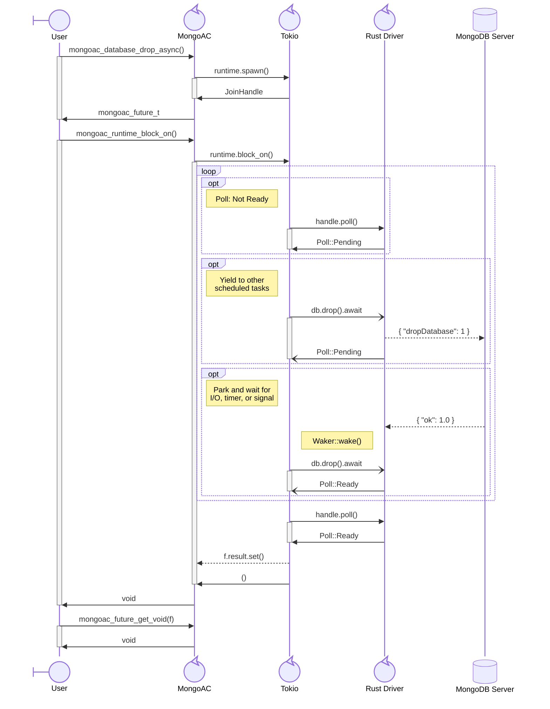
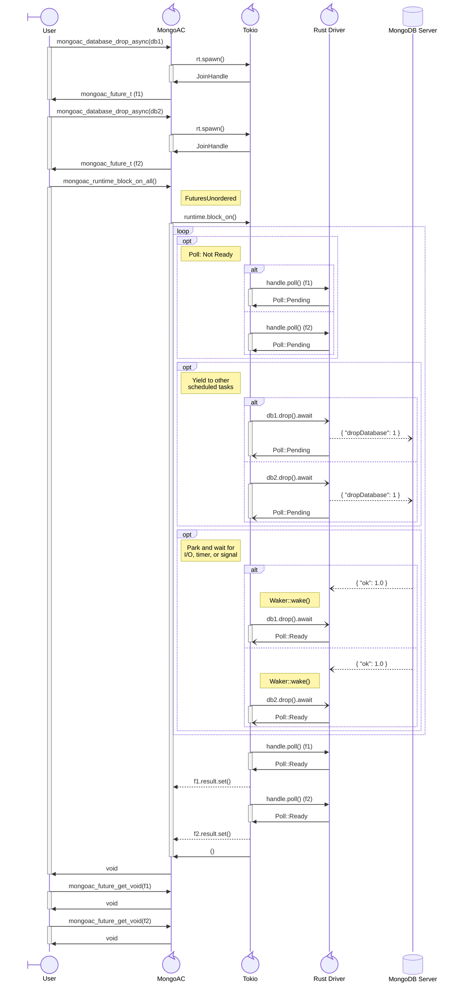
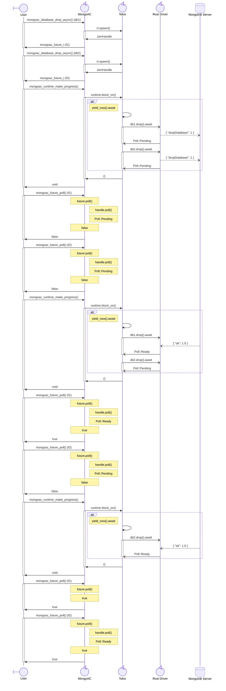

# MongoDB Async C Driver Design Document

## Abstract

This project is the initial design specification for the new MongoDB Async C Driver.

## Terminology

| Term | Shortname | Description |
|---|---|---|
| **Async C Driver** | mongoac | This library (providing an async C API). |
| **C Driver** | mongoc | The existing synchronous C library. |
| **BSON Library** | bson2 | The existing C BSON library (v2). |
| **mongo-c-driver** | N/A | The repository providing bson2, mongoc, and mongoac. |
| **Rust Driver** | Rust API | The `mongodb` crate. |
| **Rust FFI** | mongoac | This library (translating the Rust API into a C FFI). |

## Specification

This section describes how the initial set of features for the mongoac library are expected to be implemented.

### Build System

The mongoac library is defined as a new CMake subproject under `src/libmongoac` alongside `src/libbson` and
  `src/libmongoc`.
All Rust crates (analogous to C components) are built using Cargo (rustc).
Crate headers are generated using `cbindgen`, as defined by the `generate-crate-headers` workspace member.
CMake is completely responsible for passing the environment variables and compilation flags required to build the
  mongoac library.

> [!NOTE]
> Isolating CMake configuration options to the bson and mongoc libraries is out-of-scope.

#### External Dependencies

The following executables are **new** required external dependencies or **stricter** than present mongo-c-driver
  requirements:

- `cmake`: 3.25 or newer.
- `cargo`: 1.88 or newer (2024 Edition)
- `patchelf`: Linux only.
- C Compiler (header validation only): C99 or newer, see `CMakeLists.txt`.
- C++ Compiler (tests only): C++17 or newer, see `CMakeLists.txt`.

All Rust crate dependencies are automatically obtained by `cargo`.
This is similar to how CMake obtains Catch2 and `uv` obtains Python packages.

No C or C++ compiler is required to build mongoac libraries themselves (handled entirely by Cargo).
A C compiler is only required when `CMAKE_VERIFY_INTERFACE_HEADER_SETS` is set to `ON`.
A C++ compiler is only required to build the Catch2 test suite (with C++17).
The stricter C/C++ toolchain and CMake version requirements are expected to be acceptable for users given the
  comparatively more-demanding Rust toolchain requirements.

> [!NOTE]
> Although the `mongoac` project itself does not require a C or C++ compiler, the top-level `mongo-c-driver` project
>   still requires a C compiler due to `LANGUAGES C`.

> [!TIP]
> - [Why CMake 3.25?](#why-cmake-325)
> - [Why patchelf?](#why-patchelf-soname)

#### Cargo Integration

CMake defines two `INTERFACE` targets:

| Target | Type | Compile Definition |
|---|---|---|
| `mongoac::shared` | `cdylib` | *(none)* |
| `mongoac::static` | `staticlib` | `MONGOAC_STATIC` |

CMake invokes `cargo rustc` via `add_custom_command`, passing `--target-dir` inside the CMake binary directory.
The custom target directory is essential to support both single-config and multi-config CMake generators.

The `build.rs` crate is responsible for generating the `config.rs` crate, which provides configuration-dependent
  constants, according to the specific build configuration being requested by CMake.

To avoid unnecessarily coupling mongo-c-driver specific CMake configuration patterns to mongoac, CMake and pkg-config
  package config files are generated using the same CMake generation pattern as in the C++ Driver
  (`mongoacConfig.cmake.in`, `mongoac.pc.in`), but result in the same installation directory structure as the C Driver.

> [!NOTE]
> Unlike mongoc, mongoac does **not** require `ENABLE_STATIC` to build tests.

#### Build Configuration

The CMake directory structure is largely the same as the existing mongo-c-driver for source, build, and install.
However, the mongoac subproject is completely independent from the mongoc subproject: `ENABLE_MONGOC=OFF` and
  `ENABLE_MONGOAC=ON` are a valid combination of CMake options.
This impacts the `test` subdirectory (where the Catch2 test suite is implemented) the most due to complete isolation
  from existing mongoc-based test utilities and helpers, including the unified spec test runner.
Unified spec format tests are expected to follow a similar structure, potentially duplicating the list of spec test
  files under `src/libmongoac/test/json` (mirroring `src/libmongoc/test/json`).

Library file naming and versioning also mirrors existing patterns in mongo-c-driver.
However, due to the library files being generated by Cargo rather than CMake, CMake must manually create and install
  shared library symlinks.
CMake must also use `patchelf` when available (on Linux environments only, per CMake's `LINUX` variable) to correctly
  set the SONAME in the shared library file.
When `patchelf` is not found, CMake emits a warning, but does not error.

The `--target-dir` flag specified by CMake ensures Cargo's generated `config.rs` is consistent with the current CMake
  build configuration regardless of the CMake generator being used.
Configuration options are forwarded to `build.rs` using environment variables (e.g. `MONGOAC_CMAKE_BUILD_TYPE` and
  `MONGOAC_LIBRARY_TYPE`).

> [!TIP]
> - [Why patchelf?](#why-patchelf-soname)

#### Crate Headers

Header files generated via `cbindgen` are referred to as "crate headers" by this specification.

The `generate-crate-headers` Cargo workspace member under `src/libmongoac/cmake/generate-crate-headers/` isolates the
  `cbindgen` dependency from those required to build the mongoac library (mongodb, tokio, etc.).
It is responsible for ensuring each cargo header includes all dependencies required for self-contained compilation,
  including other mongoac headers needed for opaque-pointer types, and renaming exported structs from `ExampleT` (Rust
  convention) to `mongoac_example_t` (C convention).
The `mongoac_crate_headers_target` CMake custom target invokes `generate-crate-headers` via `cargo run` independent of
  the mongoac library targets.

Two headers are defined manually: `export.h` (a simplified equivalent to the export header generated by CMake) and
  `version.h` (declaring constants dependent on CMake and functions dependent on `config.rs`).
All other mongoac headers are generated via `cbindgen` by `generate-crate-headers`.

> [!TIP]
> - [Why CMake for version.h instead of cbindgen?](#why-cmake-version-header)

#### Documentation

API documentation for crate headers are under `src/libmongoac/doc/`, for symmetry with bson and mongoc docs.

```bash
uv run --frozen cmake -S . -B <build> -DENABLE_HTML_DOCS=ON
uv run --frozen cmake --build <build> --target mongoac-doc
```

### Test Infrastructure

Tests are organized into two layers (reflecting the two-layer FFI architecture described below):

- **Rust Tests**: executed via `cargo test`, written in Rust.
- **Catch2 Tests**: executed via CTest or Catch2 executable, written in C++.

Rust tests permit test coverage of internal API without requiring conditional exports (e.g. `*_EXPORT_CDECL_TESTING` in
  the C++ Driver) or requiring static library linkage (e.g. `test-libmongoc` requiring `ENABLE_STATIC=ON`).
However, most tests should primarily be written as Catch2 test cases in order to cover the actual public API layer where
   input validation (e.g. `safe_*!()`) and return value conversions take place.

A `PATCH_COMMAND` during `FetchContent_Declare()` adds support for registering Catch2 test cases with CTest, where a
  `TEST_CASE` has a duplicate name but unique tags (supported by Catch2, but not by `catch_discover_tests()`).

```cpp
// CTest: "mongoac/a/b/c/example"
TEST_CASE("example", "[a][b][c]") { ... }
```

Special tags (e.g. `[!throws]`, `[!mayfail]`, etc.) are excluded in the CTest unique test name.
However, they are still registered with CTest as labels (e.g. `!throws`, `!mayfail`, etc.).

> [!TIP]
> - [Why Catch2?](#why-catch2)
> - [Why dual testing layers?](#why-dual-testing-layers)
> - [Why custom discovery?](#why-custom-test-discovery)

### Rust FFI Design

#### Two Layers

The Rust FFI uses a two-layer architectural design:

- **Layer 1 (Public API):** exported symbols prefixed with `mongoac_`.
  Functions use "safety macros" to consistently handle conversions between unsafe C and safe Rust, validating only what
    is needed to enforce FFI safety (e.g. null pointer checks, UTF-8 validation, etc.) and translating return values (or
    errors) into their C representations (e.g. `Box::into_raw()`, `safe_error!()`, etc.).
  This layer is tested by Catch2 tests.
- **Layer 2 (Internal Rust):** safe Rust implementations of corresponding public API symbols.
  Functions are defined as methods of the corresponding `struct` being operated on.
  No `unsafe` blocks are present in Layer 2 (with the exception of unenforcable library-wide preconditions on ptr+len
    pairs): all other unsafe input validation and C representation conversions are handled by Layer 1.
  This layer is tested by Catch2 tests (via Layer 1) and via `cargo test`.

This results in the following general pattern for a given `example.rs` crate:

```c
// example.h (generated)
typedef struct mongoac_example_t mongoac_example_t;

mongoac_example_t* mongoac_example_new();
void mongoac_example_destroy(mongoac_example_t *example);
mongoac_future_t* mongoac_example_async(mongoac_string_view_t input, mongoac_error_t *error);
```

```rs
// example.rs

use crate::error::ErrorT;       // mongoac_error_t
use crate::future::FutureT;     // mongoac_future_t
use crate::string::StringViewT; // mongoac_string_view_t

// `mongoac_example_t`: renamed by cbindgen via generate-crate-headers.
pub struct ExampleT {
  inner: mongodb::Example, // Underlying Rust API struct.
  // ...
}

#[unsafe(no_mangle)]
pub extern "C" fn mongoac_example_new() -> *mut ExampleT {
  Box::into_raw(Box::new(ExampleT::new()))
}

#[unsafe(no_mangle)]
pub extern "C" fn mongoac_example_destroy(example: *mut ExampleT) {
  // if !example.is_null() {
  //     unsafe { drop(Box::from_raw(example)) }
  // }
  safe_drop!(example)
}

#[unsafe(no_mangle)]
pub extern "C" fn mongoac_example_async(
  example: *mut ExampleT, input: StringViewT, error: *mut ErrorT
) -> *mut FutureT {
  // Layer 1: optional pointer.
  // let error = match unsafe { error.as_mut() } {
  //     Some(e) => { e.clear(); Some(e) },
  //     None    => None,
  // }
  let error = safe_optional_error_as_mut!(error);

  // Layer 1: required parameter.
  // let example = match unsafe { example.as_mut() } {
  //     Some(r) => r,
  //     None => {
  //         $crate::private::safety::invalid_argument(
  //             $error,
  //             concat!(stringify!(example), ": must not be null"),
  //         );
  //         return Default::default();
  //     }
  // }
  let example = safe_as_mut_with_error!(example);

  // Layer 1: required UTF-8 string view.
  // let input = {
  //     if input.data.is_null() {
  //         $crate::private::safety::invalid_argument(
  //             $error,
  //             concat!(stringify!(input), ": must not be null"),
  //         );
  //         return Default::default();
  //     }
  //     match std::str::from_utf8(unsafe {
  //         std::slice::from_raw_parts(input.data.cast::<u8>(), input.len)
  //     }) {
  //         Ok(s) => s,
  //         Err(_) => {
  //             $crate::private::safety::invalid_argument(
  //                 $error,
  //                 concat!(stringify!(input), ": must be valid UTF-8"),
  //             );
  //             return Default::default();
  //         }
  //     }
  // }
  let input = safe_string_view_with_error!(input);

  // Layer 1: error handling.
  // let future = match example.async(input) {
  //     Ok(val) => val,
  //     Err(err) => {
  //         if let Some(e) = error {
  //             *e = ::std::convert::Into::into(err);
  //         }
  //         return Default::default();
  //     }
  // }
  let future = safe_error!(example.async(input));

  // Layer 1: returning an owning pointer.
  Box::into_raw(Box::new(future))
}

// Layer 2: methods and helper functions.
impl ExampleT {
  fn new() -> ExampleT {
    // Layer 2: safe Rust implementation.
  }

  // `drop()` is unnecessary in safe Rust.

  fn async(input: &str) -> FutureT {
    // Layer 2: safe Rust implementation.
  }
}
```

<a id="bson-structs"></a>

#### BSON Documents

BSON documents are passed through the FFI as raw bytes represented by simple `(ptr, len)` structs.
Alongside the [string structs](#string-structs), these are the only non-opaque structs declared in the public API.
`mongoac_bson_t` represents an owning BSON document and `mongoac_bson_view_t` represents a non-owning BSON document;
  `mongoac_bson_t` must be destroyed, whereas `mongoac_bson_view_t` does not need to be destroyed.
Both contain a `uint8_t const*` pointer and do *not* permit mutability of BSON bytes in any circumstance.

For mongoac internals, BSON bytes are converted into `mongodb::bson` representations with validation handled by one of
  `from_bytes()`, `from_reader()`, and `deserialize_from_slice()` depending on the context.
For mongoac users, BSON bytes may be converted to their representation of choice, e.g. using `bson_init_static()` or
  `bson_new_from_data()` for the bson2 library.
As a **library-wide precondition**, the ptr+len pair MUST satisfy reasonable requirements, such as every byte in the
  range `[0, data.len)` being accessible, so they can be passed to `std::ptr::slice_from_raw_parts*()` without UB.
For simplicity, `data.len` validity is preconditioned on `data.ptr` being not-null, e.g. `(null, 123)` is valid.

For asynchronous operations, mongoac copies the BSON bytes into a `RawDocumentBuf`.
For synchronous operations, mongoac directly uses the BSON bytes via `RawDocument` whenever able, only copying when the
  Rust Driver API forces a copy.
In all cases, the caller does not need to preserve the lifetime of the BSON bytes beyond the duration of the function
  call.

BSON documents returned by mongoac may either be owning or non-owning.
Owning BSON documents directly transfer ownership of the BSON bytes to `mongoac_bson_t` as a `Box<[u8]>`.
Non-owning BSON documents are simply returned as a ptr+len pair in `mongoac_bson_view_t`.
In all cases, passing a BSON document through the FFI does not by itself require a deep-copy of the BSON bytes.
As a **library-wide precondition**, the BSON bytes of a `mongoac_bson_view_t` are valid only for the lifetime of the
  associated object that owns the BSON document being viewed.
Structs such as `mongoac_cursor_t` will need to clearly document which operations may invalidate associated views.

> [!TIP]
> - [Why raw bytes to represent BSON documents?](#why-bson-raw-bytes)

<a id="string-structs"></a>

#### Strings

Strings are represented by simple `(ptr, len)` structs in the FFI.
Alongside the [BSON structs](#bson-structs), these are the only non-opaque structs declared in the public API.
Their behavior mirrors that of the BSON document structs, including the **library-wide invariant** that the ptr+len pair
  satisfies the same validity and accessibility requirements as the BSON structs.

> [!TIP]
> - [Why ptr+len for strings?](#why-ptr-len-strings)

#### Opaque Pointers

All structs owned and returned by mongoac (except the [BSON](#bson-structs) and [string](#string-structs) structs) are opaque.
Safety macros enforce not-null requirements as graceful errors returned via `mongoac_error_t *error` out-params.
Owning pointers to mongoac structs are returned using `Box::into_raw()` and destroyed by `drop(Box::from_raw(ptr))`
  within a dedicated `mongoac_*_destroy()` function using `safe_drop!(ptr)`.

All public structs are defined as `pub struct ExampleT` or `pub enum ExampleT` (both `struct` in the FFI), which are
  renamed to `mongoac_example_t` by cbindgen via `generate-crate-headers`.
The `T` suffix in Rust mirrors the `_t` suffix in C and prevents ambiguity with existing Rust structs and traits (e.g.
  `ErrorT` vs. `std::error::Error`, `ClientT` vs. `mongodb::Client`, etc.).
Private structs (under `src/libmongoac/private/`) do not need to follow this naming convention.

The Rust API treats most non-options classes such as `Client`, `Database`, and `Collection` as immutable
  post-construction.
This means most public API operating on these objects are logically-const.
Therefore, with the exception of `mongoac_*_destroy()`, most functions `mongoac_example_*(example, ...)` may accept
  `const mongoac_example_t *example` when `ExampleT` corresponds to an immutable struct.
The mongoac library internally uses `Arc<Mutex<T>>` for consistency with the Rust Driver's thread-safety model.
This is conceptually analogous to `std::shared_ptr<std::pair<std::mutex, T>>` in C++.

> [!TIP]
> - [Why typed options structs?](#why-typed-options)

> [!NOTE]
> `ClientSession` is a notable exception to the "non-options structs are immutable" pattern.

#### Input Validation

The `private/safety.rs` crate provides macros which encapsulate unsafe C-to-Rust input validation.
All safety macros are defined to avoid runtime panics, both during validation (error handling) and after validation
  (in safe Layer 2 internal Rust code).
The `safe_optional_error_as_mut` macro (whose result is then passed to subsequent `*_with_error` macros) clears the
  optional `mongoac_error_t *error` parameter (when not null) so that success paths always return `Ok`.
The macros which handle string-like arguments additionally validate the string is UTF-8 for Rust API compatibility:
  this is also [a language-wide invariant](https://doc.rust-lang.org/book/ch08-02-strings.html).
These macros are expected to be used exclusively in Layer 1 (Public API) function definitions.

> [!NOTE]
> Embedded null bytes are valid UTF-8 and therefore *not* rejected by Layer 1 input validation.

#### Concurrency Model

The concurrency model used by mongoac uses an "executor + task handle + manual progress" pattern:

- `mongoac_runtime_t` is a per-client "executor" backed by a Tokio `current_thread` runtime.
  It owns the task queue, I/O and timer drivers, and task scheduler.
- `mongoac_future_t` is a "task handle" representing an asynchronous task scheduled with the associated runtime.
  `mongoac_future_is_ready()` returns true once the future is complete and the future has been polled at least once
    via `block_on*()` or `mongoac_future_poll()`.
- An async "task" is a Rust future spawned with the associated runtime.
  The task makes progress by a call to `make_progress*()` or `block_on*()`.
  The result of a task is returned via an associated `mongoac_future_t` when `is_ready()` returns `true` by calling
    `get_*()`.

All async tasks make progress by an explicit call to either `mongoac_runtime_make_progress*()` or
  `mongoac_runtime_block_on*()`.
Any thread may drive the runtime, and futures may be passed to and queried from any thread.
Both the runtime and pending futures may also be used on a single thread.

##### Runtime

Every `mongoac_client_t` contains an associated `mongoac_runtime_t` which may be obtained with
  `mongoac_client_get_runtime()`.
The `mongoac_runtime_t` is ref-counted, cheap to clone, and may outlive the `mongoac_client_t`.
However, any tasks spawned using the associated client MAY NOT be executed using the runtime of another client.
Any thread may call `make_progress*()` or `block_on*()` on a given runtime; parallel progress is coordinated by Tokio's
  `current_thread` scheduler such that only one thread has ownership of the runtime and making progress at a time.

> [!NOTE]
> In terms of C++26 Execution, `mongoac_runtime_t` is similar to a "Scheduler" in how it behaves like a handle to an
>   execution resource.
> However, instead of being a lightweight, non-owning factory for lazy senders which does not itself drive execution,
>   `mongoac_runtime_t` also behaves as a single-threaded executor: the thread which invokes `make_progress*()` or
    `block_on*()` and obtains exclusive ownership of the runtime becomes the executor for the duration of the invocation.
> It is comparable to an `io_context` in Boost ASIO or an event loop in Python's `asyncio`.

##### Futures

A `mongoac_future_t` is a read-only, ref-counted handle to the result of an underlying async task.
A future must be passed to its associated runtime in order for the underlying async task to make progress.
When the result of a future is ready, the result must be obtained by a correct call to `mongoac_future_get_*()`.
When the result is a return value, `mongoac_error_code(error)` equals `MONGOAC_ERROR_CODE_OK`; otherwise (an error
  occurred or the incorrect return type was requested), `mongoac_error_code(error)` is set accordingly.

All async operations in the mongoac API return a `mongoac_future_t`, even when the return value is `void` (e.g.
  `mongoac_collection_drop_async()`).
A given future may make progress by a call to `block_on*()` or `make_progress*()` on its associated runtime.
Once a given future is _complete_, it must be _polled_ at least once (via `block_on*()` or via `mongoac_future_poll()`)
  in order for the result of the underlying task to be made ready.

> [!NOTE]
> In terms of C++26 Execution, `mongoac_future_t` is not like a lazy "Sender" (the task is already spawned) or a oneshot
>   "Operation State" (it is cloneable and read-only).
> Instead, it is a non-blocking, ref-counted handle comparable to `std::shared_future<std::any>` or Python
>   `asyncio.Future` which asynchronously waits for the associated runtime to make progress and complete the underlying
>   task.

> [!IMPORTANT]
> The Rust Driver may spawn [background tasks](#why-runtime-make-progress) when certain objects are destroyed
>   which have no `mongoac_future_t` handle, e.g.:
>
> - `mongoac_cursor_destroy()`: spawns a background task to execute a `killCursors` command.
> - `mongoac_client_session_destroy()`: spawns a background task to abort any in-progress transactions.
> - `mongoac_client_destroy()`: spawns a background task to execute an `endSessions` command.
>
> To ensure these background tasks are able to run to completion, `mongoac_client_shutdown*()` may be used to block on
>   these background tasks.

##### Make Progress

All async tasks must "make progress" by invoking one of the following `mongoac_runtime_t` functions:

- `block_on*()`: block until the given future(s) are ready.
- `make_progress*()`: make progress on all scheduled tasks without indefinitely blocking the current thread.

The `make_progress*()` functions are also required to make progress on
  [background tasks](#why-runtime-make-progress) which may have no corresponding `mongoac_future_t`.
These have no C++26 Execution equivalents; instead, they are comparable to `io_context::poll_one()` from Boost ASIO,
  `uv_run(loop, UV_RUN_NOWAIT)` from libuv, or `loop._run_once()` from Python's `asyncio`.

The `make_progress_for*()` variant makes progress for at least a given duration without spin-looping.
All other `block_on*()` and `make_progress*()` functions support a `*_with_timeout()` variant to avoid indefinitely
  blocking the current thread.

> [!NOTE]
> In terms of C++26 Execution, `block_on*()`, `block_on_any*()`, and `block_on_all*()` are similar to consuming senders
>   with `sync_wait`, `when_any`, and `when_all` respectively.
> However, instead of being lazy senders, the inputs are already-spawned futures, and work is always done on the thread
>   invoking the function instead of in an arbitrary execution context.
> It is also comparable to a single-threaded `io_context::run()` and `io_context::run_one()` from Boost ASIO or to
>   `loop.run_until_complete()` from Python's `asyncio`.

> [!IMPORTANT]
> The Tokio `current_thread` runtime drives I/O and timers once every `event_interval` (default: `61`) polls of
>   scheduled tasks.
> A non-yielding task may block the current thread, preventing the timer from advancing until the task completes.
> Therefore, actual elapsed time may exceed the given `timeout_ms` by up to `event_interval` polls' worth of execution
>   time.
> If the default value of `61` is not fast enough, `mongoac_client_t` may need to expose a configuration option to
>   control this parameter.

> [!IMPORTANT]
> The `current_thread` runtime is cooperative: when no thread calls `make_progress*()` or `block_on*()` for an
>   indefinite period of time, no background tasks associated with the runtime make any progress during that time.
> This may lead to latency and staleness on the first operation executed after a long idle period, such as:
>
> - Server Topology: the next operation may use an outdated server topology or wait for a fresh heartbeat to complete.
> - SRV Hosts: the mongos list may be outdated until the next SRV poll is executed.
> - Connection Pool: the operation may need to wait for idle connections to be dropped and new connections to be
>     established.
> - Timers and Deadlines: operation timeouts may exceed the expected deadline when the runtime is suspended while the
>     deadline passes by.
>
> Some tips to mitigate the above issues include:
>
> - Periodically call `make_progress*()` on a worker thread or event loop.
> - Tune URI options such as `maxIdleTimeMS`, `serverSelectionTimeoutMS`, and `heartbeatFrequencyMS`.
> - Avoid scheduling urgent operations immediately after a long idle period; allow background tasks to warmup first
>     using `make_progress*()` or scheduling a non-urgent `block_on*()`.

> [!TIP]
> - [Why runtime make_progress?](#why-runtime-make-progress)
> - [Cancellation is deferred](#defer-cancellation)

#### Error Model

Errors are reported using an optional `mongoac_error_t` out-parameter.
It is always the last parameter in the list of parameters: `mongoac_example(..., error)`.
On error, the return value of an error-aware FFI function is generally set to default value of the return type.
To avoid reserving special values or forcing incompatibility with underlying Rust Driver API types (in particular for
  integral types) or force the use of out-parameters in order to indicate result vs. error via `bool` return values,
  the return value is generally *not* used to indicate whether an error has occurred.
Instead, users must check for a non-zero error code after the error-aware operation:

```c
mongoac_error_t* const error = mongoac_error_new();

// We do NOT reserve any special values (e.g. `0`, `-1`, `INT_MIN`, etc.) to indicate an error.
int const result = mongoac_example(example, error);

// Methods to abstract this common pattern is left to the user.
if (mongoac_error_code(error) == MONGOAC_ERROR_CODE_OK) {
  use(result);
} else {
  // Handle error.
}

mongoac_error_destroy(error);
```

Unlike the current C Driver's `bson_error_t`-based error model, which uses a fixed-width inline buffer to store error
  messages, `mongoac_error_t` permits arbitrary error message lengths by returning an owning `mongoac_string_t`.
This not only permit lossless (never truncated) error messages, but also the freedom to extend the capabilities of the
  `mongoac_error_t` API without being held back by ABI compatibility (e.g. exposing additional API to query error
  labels, write concern errors, etc.).

Modelling C++'s `<system_error>` and the error conditions from mongocxx, the `mongoac` (1) error category currently only
  defines four error codes: `Ok` (0), `InvalidArgument` (1), `RuntimeError` (2), and `Timeout` (3).
This design specification currently proposes the following error categories:

- `None` (0): the default-initialized `mongoac_error_t`.
- `MongoAC` (1): the mongoac library.
- `Server` (2): the MongoDB server (e.g. `Command` and `Write` errors).
- `Rust` (3): the `mongodb` crate (e.g. client-side invalid arguments or runtime errors).
- `Bson` (4): the `mongodb::bson` crate (e.g. BSON document validation errors).

Both error categories and error codes also define a special `Unknown` variant to distinguish unknown or unexpected
  values from the `Ok` state.

> [!TIP]
> - [Why #define macros?](#why-define-macros)

### Supported Features

#### Client Options

The Rust Driver API supports two ways to construct a client object: a connection string (URI) and an options struct.
The mongoac API mirrors this structure in its API:

```c
// `mongodb::client::Client::with_uri_str()`
mongoac_client_t* client = mongoac_client_new("mongodb://localhost:27017?appName=example");

// `mongodb::client::Client::with_options()`
mongoac_client_options_t* opts = mongoac_client_options_new();
mongoac_client_options_set_app_name(opts, "example", NULL);
mongoac_client_t* client = mongoac_client_new_with_options(opts, NULL);
mongoac_client_options_destroy(opts);
```

> [!NOTE]
> `ClientOptions::parse()` is an async function due to performing
>   [DNS lookups](https://docs.rs/mongodb/latest/mongodb/action/struct.ParseConnectionString.html#method.resolver_config)
>   given `mongodb+srv://`.
> The current mongoac implementation does not declare a corresponding `mongoac_client_options_parse_async()` due to
>   dubious value; instead, the potential DNS lookups are treated as part of `mongoac_client_new()` construction.

The `mongoac_client_options_t` object is expected to be the primary means by which mongoac-specific configuration
  options are specified, such as parameters to configure the Tokio runtime (e.g. `event_interval`).
Currently, the only mongoac-specific options are [boolean toggles](#event-api) to enable event monitoring for commands,
  SDAM, and CMAP.

> [!TIP]
> - [Feature-gated fields](#deferred-client-options-fields)

#### Client Metadata

The mongoac library always appends the following client metadata on construction:

- `client.driver.name`: "mongoac"
- `client.driver.version`: "0.1.0-dev" (from `VERSION_CURRENT`)
- `client.platform`: "`<build-type><link-type>`"

where `<build-type>` is either Debug ("d") or Release ("r") and `<link-type>` is either shared ("h") or static ("t"),
  deliberately mirroring the
  [library filename ABI tag pattern](https://github.com/mongodb/mongo-cxx-driver/blob/70935c76a1153d564c622968899085991042e249/cmake/BsoncxxUtil.cmake#L40-L60)
  used by the C++ Driver.

When the user sets `driver_info` for `mongoac_client_options_t`, the metadata is appended _after_ client construction in
  order to avoid overwriting mongoac's own client metadata.
Users may also append metadata post-construction using `mongoac_client_append_metadata()` instead.

<a id="event-api"></a>

#### Event API

> [!NOTE]
> The reference implementation only support command events and uses BSON serialization instead of typed structs.

The Rust Driver API supports tracking events by registering a callback function for commands, CMAP, and SDAM.
To [avoid using callback functions](#rejected-callbacks) in the FFI, an index-based buffer API is used instead.
When the boolean toggle is enabled in `mongoac_client_options_t` (defaults to `false`), `mongoac_client_t` registers an
  internal callback function for the appropriate event category during construction.
The internal callback function directly moves the given event object into the event queue of the associated client
  object.
These event objects are then accessed by the user using `*_count()`, `*_get(n)`, and `*_clear(n)`.

The event queues are implemented as `VecDeque`: a "double-ended queue implemented with a growable ring buffer".
The `count()` and `get(n)` operations are O(1) operations, whereas `clear(n)` is O(n).
Due to being a ring buffer, the O(n) clear does not require any internal reallocations of existing objects.

Events will be represented as typed structs per event category:

- `mongoac_command_event_t`: `mongodb::event::command::CommandEvent`
- `mongoac_sdam_event_t`: `mongodb::event::sdam::SdamEvent`
- `mongoac_cmap_event_t`: `mongodb::event::cmap::CmapEvent`

All three event category structs, as well as their corresponding event type structs, are non-owning, read-only views to
  the underlying event object within the buffer, e.g. `mongoac_command_started_event_get_command_name()` returns
  `mongoac_string_view_t` (not `mongoac_string_t`).
To obtain the underlying variant (e.g. `CommandEventStarted` from `CommandEvent`), the event category structs will
  provide an `get_<type>()` API similar to `get_<type>()` for `mongoac_future_t`.
Unlike `mongoac_future_t`, the underlying type must be queryable by the user due to the lack of an explicit,
  deterministic correspondance between any given event object and its expected type (unlike futures, where the result
  type is completely determined by the operation which spawns the future).
Therefore, a `*_get_type() -> mongoac_<event>_type_t` "enumeration" (constant macros) will be required (similar to
  the C++ Driver's `bsoncxx::v1::element::view::type_id()` API).

```c
mongoac_command_event_t* event = mongoac_client_get_command_event(client, 0);

switch (mongoac_command_event_get_type(event)) {
  case MONGOAC_COMMAND_EVENT_TYPE_STARTED: {
    mongoac_command_started_event_t* e = mongoac_command_event_get_started(event);
    mongoac_command_started_event_get_command_name(e); // mongoac_string_view_t
    mongoac_command_started_event_destroy(e);
  } break;

  case MONGOAC_COMMAND_EVENT_TYPE_SUCCEEDED: {
    mongoac_command_succeeded_event_t* e = mongoac_command_event_get_succeeded(event);
    mongoac_command_succeeded_event_get_command_name(e); // mongoac_string_view_t
    mongoac_command_succeeded_event_destroy(e);
  } break;

  case MONGOAC_COMMAND_EVENT_TYPE_FAILED: {
    mongoac_command_failed_event_t* e = mongoac_command_event_get_failed(event);
    mongoac_command_failed_event_get_command_name(e); // mongoac_string_view_t
    mongoac_command_failed_event_destroy(e);
  } break;
}

mongoac_command_event_destroy(e);
```

#### Server Discovery and Monitoring

The following Drivers specification features are implemented by the Rust Driver and require no additional work by the
  mongoac library:

- Client Backpressure
- Retryable Reads
- Retryable Writes
- Server Discovery
- [Server Monitoring](#event-api)
- Server Selection

Their behavior is configurable via the connection string or options struct used to construct a client object.

Wire protocol compatibility is determined by the Rust driver. See [compatibility](https://www.mongodb.com/docs/drivers/compatibility/?driver-language=rust).

#### Server Selection

Read preference may be specified by setting the appropriate option field for the client, database, collection, or
  individual operation.

Custom server selection is supported via a synchronous callback function `mongoac_server_predicate_t`, assigned to an
  options struct via `mongoac_server_selector_t` (function pointer + user data).
The function MUST NOT invoke a progress function on the associated runtime (no re-entrancy) and MUST NOT fail in any
  manner (panic, deadlock, etc.).
The function SHOULD NOT perform any potentially blocking operations, otherwise the entire runtime progress will be
  blocked by the callback function.

The callback's only parameter is a non-owning, read-only `mongoac_server_info_t` object whose lifetime is valid only for
  the duration of the callback function invocation.

> [!NOTE]
> If the FFI is ever used by a runtime-based language (e.g. Python, Java, JavaScript, etc.), the caller must ensure that
>   any user-provided values used by the callback function are accessible and synchronized with consideration for the
>   thread responsible for making progress.
> If the values accessed by the callback function are on the same thread as the one making progress, synchronization
>   should not be necessary.

> [!TIP]
> - [Why use a callback for custom server selection?](#why-server-selection-callback)

#### Retryable Reads and Writes

Handled by the Rust Driver (enabled by default).
May be explicitly (un)set by the user using URI options or `mongoac_client_options_set_retry_*()`.
The Rust Driver API does not support configuring these options at any level other than the `Client` object.

#### Enumerate Databases

There are two client-level operations to enumerate databases:

- `list_databases()`: returns an array of `DatabaseSpecification`.
- `list_database_names`: returns an array of strings (database names).

The current implementation returns both values as a BSON array:

```
// list_databases():
[
  {"name": "db",      "size_on_disk": 123, ...},
  {"name": "example", "size_on_disk": 456, ...},
  ...
]

// list_database_names():
["db", "example", ...]
```

In order to return the array of values as `mongoac_database_specification_t` or `mongoac_string_t`, an approach to
  support [typed arrays in the FFI](https://github.com/eramongodb/mongoac-spec/issues/25) will be necessary.

Drivers Specification states:

- "Drivers SHOULD specify the `nameOnly` option when executing the `listDatabases` command..."
- "Drivers SHOULD report the `filter`, `authorizedDatabases`, and `comment` options when implementing this method."
- "Drivers MAY" report `totalSize` ... but this is not necessary."

The Rust Driver API implicitly sets `nameOnly` for `listDatabases`, but does not provide an explicit option for the
  user to enable in `ListDatabaseOptions`.
All three options (`filter`, `authorizedDatabases`, and `comment`) are supported; `totalSize` is not reported.

#### Enumerate Collections

There are two database-level operations to enumerate collections:

- `list_collections`: returns a cursor over `CollectionSpecification` documents.
- `list_collection_names`: returns an array of strings (collection names).

Each `CollectionSpecification` is returned from the cursor as a serialized BSON document:

```
{
  "name": "coll",
  "type": "collection",
  ...
}
```

Drivers Specification states:

- "Drivers MAY allow the `nameOnly` and `authorizedCollections` options to be passed when executing the
    `listCollections` command..."

As with the database enumeration API, `nameOnly` is not an explicit option despite being used internally by the
  `listCollections` command.
Although `authorizedCollections` may be set explicitly, it is only used by `list_collection_names`; the Rust Driver
  ignores this option when `nameOnly` is not `true`.

#### Read and Write Concerns

`mongoac_read_concern_t` and `mongoac_write_concern_t` may be used to set option fields for all option structs which
  support them.

> [!NOTE]
> The CRUD spec permits sending `readConcern: {}` to override a parent-level read concern and instead use the server's
>   default read concern.
> However, the Rust Driver API (thus mongoac) currently cannot support this due to `ReadConcern.level` being a
>   non-optional field.

> [!TIP]
> - [Why typed options structs?](#why-typed-options)

<a id="crud-operations"></a>

#### CRUD Operations

CRUD operations generally establish the typical async+sync API and implementation pattern, including the optional
  `session` parameter, `options` parameter, `mongoac_bson_view_t` for BSON arguments (i.e. `filter`), and cursors.
`estimated_document_count` is a notable exception that does not permit a session parameter.
`insert_many` and `aggregate` demonstrate the `ptr+len` approach to handling arrays of BSON documents as arguments.

> [!NOTE]
> For consistency with return values, we may consider using a BSON array to represent the array of BSON documents:
>
> ```c
> // Currently proposed ptr+len approach:
> mongoac_bson_view_t docs[] = {a, b, c};
> mongoac_collection_insert_many(coll, session, docs, 3u, error);
>
> // Alternative `mongoac_bson_view_t` approach:
> bson_t docs;
> bson_array_builder_t* builder = bson_array_builder_new();
> bson_array_builder_append_document(builder, a);
> bson_array_builder_append_document(builder, b);
> bson_array_builder_append_document(builder, c);
> bson_array_builder_build(builder, &docs);
> mongoac_collection_insert_many(coll, session, (mongoac_bson_view_t){bson_get_data(&docs), docs.len}, error);
> ```

> [!NOTE]
> The reference implementation uses BSON serialization instead of typed result structs (e.g. `{"insertedId": <id>}`
>   instead of `InsertOneResult`) and uses BSON serialization for `Find*Options` and `CreateCollectionOptions`.
> This is only to minimize the scope of the reference implementation: the real-world implementation will fully implement
>   typed structs both for options and for return values.

All result types for individual operations will have a corresponding typed struct (e.g. `mongoac_insert_one_result_t`
  for `InsertOneResult`) for consistency with the CRUD specification.
`mongoac_future_t` will need extensions to its `get_*()` API accordingly (e.g.
  `mongoac_future_get_insert_one_result() -> mongoac_insert_one_result_t*`).

```c
mongoac_cursor_t* cursor = mongoac_collection_find(coll, session, filter, options, error);
while (mongoac_cursor_next(cursor, error)) {
    mongoac_bson_view_t doc = mongoac_cursor_current(cursor);
    // ...
}
mongoac_cursor_destroy(cursor);
```

> [!NOTE]
> Though not in the initial scope of features, these patterns are expected to naturally extend to the client bulk
>   writes with the addition of structs such as `mongoac_write_model_t` (for
>   `mongodb::client::options::bulk_write::WriteModel`) and extending `mongoac_error_t` to support
>   `mongoac_error_get_bulk_write()` (for `mongodb::error::bulk_write::BulkWriteError`).

#### Sessions

The Rust Driver manages server sessions internally.
The mongoac library only needs to expose handles over `ClientSession` and support its use with session-aware API.
`mongoac_client_start_session()` begins a session and `mongoac_client_session_destroy()` ends the session.
The Rust Driver handles cancellation of in-progress transactions when applicable.

> [!IMPORTANT]
> The requirement that all operations associated with a session MUST be executed sequentially remains unchanged
>   regardless of support for asynchronous execution:
>
> ```c
> mongoac_future_t* f1 = mongoac_collection_insert_one_async(coll, session, doc1, options, error);
>
> // Whether via `block_on*()` or by `make_progress*()` on this thread or another thread...
> mongoac_runtime_block_on(runtime, f1, error);
>
> // ... the operation must have completed its execution...
> assert(mongoac_future_is_ready(f1));
>
> // ... before initiating the next operation for the associated session.
> mongoac_future_t* f2 = mongoac_collection_insert_one_async(coll, session, doc2, options, error);
> ```
>
> Note it is still acceptable to interleave operations for unrelated sessions (or no sessions at all).

#### Cursors

Where the Rust Driver API returns a `Cursor` or `SessionCursor` (determined by whether an optional `session` argument is
  provided), the mongoac library returns `mongoac_cursor_t`.
The session object given at the start of the operation is internally stored by the returned cursor object to avoid
  burdening the user with explicitly passing the session object to subsequent cursor operations (i.e. `advance()`).
Destroying a `mongoac_cursor_t` triggers a `killCursors` command as a background task whose execution depends on other
  progress functions (there is no future to block-on).

> [!TIP]
> - [Why a single `mongoac_cursor_t` type?](#why-single-cursor-type)

#### Run Command

The mongoac library simply forwards arguments for `mongoac_database_run_command()` and
  `mongoac_database_run_cursor_command()` to `Database::run_raw_command()` and `Database::run_raw_cursor_command()`
  respectively.
When a mismatch occurs between the command type and the function invoked (for document vs. cursor return values), a
  runtime error is returned by the Rust Driver.

#### Collation

Collation will be supported as a `mongoac_collation_t` (`Collation`) struct representing a typed options field similar
  to other options field structs.

> [!NOTE]
> Opcode-based unacknowledged writes are inapplicable given the Rust Driver only supports `OP_MSG` and does not support
>   unacknowledged writes.

#### Collection Management

Collection management is implemented as straightforward functions operating on `mongoac_database_t`.
The current implementation uses serde deserialization to minimize scope: the real-world implementation will implement
  the full `mongoac_create_collection_options_t` struct, which includes support for the `viewOn` and `pipeline` fields.

<a id="index-management"></a>

#### Index Management

The Rust Driver API implements the "Standard API" for index management.
Accordingly, mongoac will support index management with the following `mongoac_collection_t` functions:

- `create_index()`: accepts a single `mongoac_index_model_t` and returns a `mongoac_string_t` (index name).
- `create_indexes()`: accepts an array (ptr+len) of `mongoac_index_model_t` and returns a `mongoac_bson_t` (BSON array
    of index names).
- `list_indexes()`: returns a `mongoac_cursor_t` over index specification documents.
- `list_index_names()`: returns an array of strings (index names).
- `drop_index()`: accepts an index name (as a string).
- `drop_indexes()`: no parameters or return value.

For simplicity and consistency with the cursor API, the cursor returned by `list_indexes()` will return its value as a
  serialized BSON document (`mongoac_bson_view_t`) rather than as a `mongoac_index_model_t` struct.

> [!TIP]
> - [Open Question: Array Representation](https://github.com/eramongodb/mongoac-spec/issues/25)
> - [Why a single `mongoac_cursor_t` type?](#why-single-cursor-type)
> - [Why typed options structs?](#why-typed-options)

<a id="transactions"></a>

#### Transactions

Transactions will be implemented with `start_transaction()`, `commit_transaction()`, and `abort_transaction()` on a
  `mongoac_client_session_t` object (with async variants).
The "Convenient API for Transactions" specification is not in scope, as it would require the use of
  [non-trivial callback functions](#rejected-callbacks).
When no `options` argument is provided, the session object's default transaction options (specified by
  `mongoac_session_options_set_default_transaction_options()` during construction) are applied; this is handled
  internally by the Rust Driver.

All state transitions and validation are handled by the Rust Driver; mongoac only needs to propagate the corresponding
  results or errors accordingly.
For the purpose of implementing retries for transactions (given the absence of the Convenient API), the
  `"TransientTransactionError"` and `"UnknownTransactionCommitResult"` labels may be queried using
  `mongoac_error_contains_label()`.

<a id="causal-consistency"></a>

#### Causal Consistency

Causal consistency is enabled by default for explicit sessions, but is otherwise not available.
All validation (including mutual exclusion with snapshot reads) is handled by the Rust Driver.
The required Driver behaviors needed to implement causal consistency (e.g. `operationTime`, `afterClusterTime`, etc.)
  is handled by the Rust Driver.
The `mongoac_client_session_t` API may expose supported accessors such as `get_operation_time()` or
  `advance_operation_time()` (though `get_causal_consistency()` is blocked on `ClientSession::causal_consistency()`
  being made public).

> [!IMPORTANT]
> Until [RUST-2412](https://jira.mongodb.org/browse/RUST-2412) is released in 3.9.0, `afterClusterTime` is not applied
>   to write commands in causally-consistent sessions outside a transaction.
> The `operationTime` from write responses is still captured and applied to subsequent reads, but the server is unable
>   to enforce the intended causal ordering.
> There is nothing that can be done by the FFI to address this issue.

## Rationale

This section explains the reasons behind certain design decisions made in the proposed specification.

### Build System

<a id="why-cmake-325"></a>

#### Why CMake 3.25?

The following CMake features are newer than the current 3.15+ requirement:

- `cmake_path()` for filename extraction and path manipulation. (3.20)
- Generator expressions in `add_custom_command(OUTPUT)` and `add_custom_command(BYPRODUCTS)` (3.20)
- `target_sources(FILE_SET HEADERS)` (3.23)
- `CMAKE_VERIFY_INTERFACE_HEADER_SETS` (3.24)
- `FetchContent_Declare(... SYSTEM)` (3.25)

<a id="why-cmake-version-header"></a>

#### Why CMake for version.h?

Version macros (`MONGOAC_VERSION_MAJOR`, etc.) cannot be defined from Rust.
`build.rs` is only responsible for defining **internal** constants as-minimally-needed to implement exported functions.
Using `configure_file()` follows the same pattern used by mongo-c-driver and ensures CMake is the source of truth
  without overcomplicating `build.rs`.

<a id="why-patchelf-soname"></a>

#### Why `patchelf`?

Cargo currently does not support setting custom SONAME for cdylib: see [rust-lang/cargo#5045](https://github.com/rust-lang/cargo/issues/5045).

On Linux, CMake owns packaging, versioning, and install rules. Using `patchelf` as a post-link step keeps the SONAME fix in the packaging layer without touching the Rust crate or Cargo.

Attempting to handle this within the `build.rs` script would require detecting platform shared-library naming
  conventions, then emitting `cargo:rustc-cdylib-link-arg` to pass `-Wl,-soname,...` to
  the linker.

<a id="why-bson-raw-bytes"></a>

#### Why raw bytes to represent BSON documents?

Despite sharing a repository with the bson2 library, the mongoac library does not need any bson2-specific features.
The mongoac library internally uses `mongodb::bson` for all BSON-related operations and compatibility with the Rust
  Driver API.
The only FFI requirement needed by mongoac to handle BSON documents is a raw pointer to underlying BSON bytes.
The length is included to avoid forcing mongoac to use `unsafe` blocks to extract the embedded document length from the
  BSON bytes (e.g. see `bsoncxx::v1::document::value`) when converting the bytes into a slice.

Using `bson_t` in the FFI would force users to use the bson2 API even when they are using their own BSON representation
  library (e.g. `bsoncxx::document::value` from the C++ Driver).
All major BSON representation libraries are trivially capable of expressing a BSON document as a sequence of raw bytes;
  forcing conversions to/from `bson_t` is completely unnecessary.
Furthermore, the mongoac implementation would be complicated by the (re)declaration of `bson_t` as an opaque struct (to
  avoid ODR violations), the need to allocate owning BSON bytes returned by the FFI using `bson_new_*()` (which forces
  unnecessary deep-copies), and the use of `unsafe` blocks in contexts that cannot be handled simply by safety macros
  (e.g. arrays of BSON documents) to convert the foreign pointer to BSON bytes into a slice that is usable in Rust code.

### Test Infrastructure

<a id="why-catch2"></a>

#### Why Catch2?

Catch2 provides CMake integration via `catch_discover_tests`, standard `TEST_CASE` macros, and native CTest parallelization. It is the natural choice for a modern C++ test suite.

> [!TIP]
> - [Why not reuse the mongoc test suite?](#rejected-mongoc-testsuite)

<a id="why-custom-test-discovery"></a>

#### Why custom discovery?

Catch2's `catch_discover_tests()` permits duplicate `TEST_CASE` names with different tags, but does not register these
  as unique tests in CTest.
Instead, only one test of many tests are registered with CTest, with the other tests silently discarded.

Rather than forcing unique `TEST_CASE` names (conflicting with native Catch2 design patterns), patching the internal
  `CatchAddTest.cmake` file to support unique test registration with tags is the most direct approach with minimal
  complexity.

<a id="why-dual-testing-layers"></a>

#### Why dual testing layers?

Rust tests exercise internal logic without cbindgen/C compilation overhead. C++ tests validate the public ABI: header syntax, opaque-pointer contracts, linking, and behavior visible to C callers.

### Rust FFI Design

<a id="why-ptr-len-strings"></a>

#### Why ptr+len for strings?

It is not possible to represent internal `str` or `String` without unnecessarily incurring deep-copies just to guarantee
  null-termination or forcing the use out-parameters to return both a pointer and length.
Given `str`/`String` (UTF-8, ptr+len) is the native representation used by the Rust language, the FFI must reflect this
  in its API to avoid expensive conversions into null-terminated byte strings and dealing with ambiguous memory
  ownership (a plain `char const*` which must be freed via mongoac instead of `free()` or `delete`).
Using an out-parameter for one or both of the ptr+len pair would break consistency with library-wide avoidance of
  out-parameters without solving the ambiguous memory ownership problem.

<a id="why-typed-options"></a>

#### Why typed options structs?

The Rust Driver discourages depending on `Deserialize` for options classes.
Quoting [RUST-2022](https://jira.mongodb.org/browse/RUST-2022):

> The presence of Deserialize on those structs is something of an accident of implementation of our automated testing
>   and something we're avoiding going forward.

Additionally, many option fields are `#[serde(skip)]` (e.g. `Client::compressors`) or `#[serde(skip_serializing)]` (e.g.
  `InsertOneOptions::write_concern`), which forces the implementation to use a custom type anyways.
For consistency, options fields (e.g. `ReadConcern`, `ServerApi`, etc.) are also typed (e.g. `mongoac_read_concern_t`,
  `mongoac_server_api_t`, etc.).
Only options fields which are fundamentally BSON documents (e.g. `filter`, `comment`, etc.) use `mongoac_bson_view_t`
  in their corresponding accessor API.

<a id="why-define-macros"></a>

#### Why #define macros instead of C enums?

C23 introduced support for declaring enumerations with a fixed underlying type.
Prior to C23, enumerations have an _unspecified_ underlying type whose permitted range of representable values is
  determined by the declared values of its enumerators.
This lack of guarantee concerning the size (or even signedness) of the underlying type makes using enumerations in a
  pre-C23 FFI challenging to support reliably over time.
Furthermore, cbindgen emits complicated standard-specific polyfill declarations in order to support this new feature in
  C23 while being compatible with pre-C23 standards.

Rather than dealing with these idiosyncracies, mongoac proposes using a simple combination of `#define` constant macros
  and typedefs for the expected enumerator type:

```c
// `pub type example_t = i32;`
typedef int32_t example_enum_t;

// `pub const EXAMPLE_ENUM_VALUE: example_enum_t = 123;
#define EXAMPLE_ENUM_VALUE 123

// fn example(example_enum_t v);
void example(example_enum_t v);
```

This ensures explicit and deterministic ABI-stable function declarations that are both backward-compatible with the C99
  standard and forward-compatible with the C23 standard.
The mongoac implementation also defines internal `enum ExampleEnum { ... }` enumerators whose variants are defined by
  the `pub const` declarations.
This ensures enumerator-like properties are satisfied (e.g. that all variants have a unique value) and allows internal
  mongoac code to be written against type-safe `enum` rather than plain constants.

<a id="why-runtime-make-progress"></a>

#### Why runtime make_progress?

A dedicated worker thread must repeatedly call `make_progress*()` or `block_on*()` to make progress on scheduled tasks.
The `make_progress_for*()` variants allow the worker thread or event loop to efficiently make progress for *at least* a
  given duration without spin-looping, and all other `block_on*()` and `make_progress*()` functions support a
  `*_with_timeout()` variant to avoid indefinitely blocking the current thread.

The Rust Driver may internally spawn background tasks which have no visible mechanism to query their in-progress state.
These background tasks include CMAP workers, SDAM monitors, and cleanup routines when dropping certain objects (e.g. a
  background `killCursors` command for `mongoac_cursor_t`, a background `endSessions` command for `mongoac_client_t`,
  etc.).
To ensure these background tasks are able to run to completion, `mongoac_client_shutdown*()` may be used to block on
  these background tasks.

<a id="why-single-cursor-type"></a>

#### Why a single `mongoac_cursor_t` type?

The separation of `Cursor` and `SessionCursor` in the Rust Driver is motivated by type safety requirements forced by
  the `&mut ClientSession` argument in calls to `SessionCursor::advance()`.
Given the (generally unenforceable) contract requiring the given session object to be consistent, it is simpler for the
  mongoac library to encapsulate this requirement by storing (a handle to) the associated session object instead.
The `&mut ClientSession` is then obtained via `Mutex<T>` to satisfy the type system (even in the case of
  single-thread-only programs).

<a id="why-server-selection-callback"></a>

#### Why use a callback for custom server selection

`SelectionCriteria::Predicate` is the only method by which the Rust Driver supports custom server selection.
There is no meaningful non-callback-based alternative approach to be considered in this circumstance (i.e. index-based
  Event API).
However, this callback function is unique compared to other potential callback-based APIs: no substantial "work" is
  expected to occur in this callback function (only accepts or rejects the given server candidate), and the `bool`
  result is returned to Rust Driver internals, not to the user (the user is the one providing the result).
Therefore, an exemption to the [no callback-based API](#rejected-callbacks) principle is justifiable.

## Rejected Ideas

This section enumerates some alternative designs that were considered but rejected.

### Test Infrastructure

<a id="rejected-mongoc-testsuite"></a>

#### Why not reuse the mongoc test suite?

Rejected: the custom C test framework used by `test-libmongoc` is heavily dependent on the mongoc library.
Given mongoac is deliberately designed to be completely independent from the mongoc library, architecturally isolating
  `test-libmongoac`'s Catch2-based C++ test framework from that of `test-libmongoc` enforces this independence.

### Rust FFI Design

#### Defining a featureful `mongoac_bson_t` API

Rejected: mongoac is a new MongoDB Driver exposing an async C API, not a new BSON representation library.
The `mongoac_bson(_view)_t` structs are declared only to support type safety and ownership semantics.

##### Reusing the bson2 API

Rejected: the mongoac library does not require or use any bson2-specific features.
The "mongodb" crate dependency already includes a dependency on the "bson" crate which provides a rich API for
  handling BSON documents; this "bson" crate is fully bundled into the mongoac library without imposing any link-time
  dependencies.
Including bson2 headers in mongoac headers and internally using bson2 symbols (i.e. `bson_destroy()`) forces mongoac
  users to unnecessarily inherit a library dependency both during build-time and link-time.
Furthermore, redeclaration of bson2 symbols for use by mongoac risks ODR violations, link compatibility issues, `unsafe`
  blocks to convert BSON bytes to/from foreign pointers, and unnecessary deep-copies of BSON bytes to respect library
  allocator consistency.

#### Concrete (Non-Opaque) Structs

Rejected: the mongoac library prioritizes compatibility with the underlying Rust Driver API.
Declaring structs as concrete types in public headers would impose FFI-specific ABI compatibility requirements.
This includes the use of inline buffers for raw bytes (e.g. `bson_t`) and strings (e.g. `bson_error_t`).

<a id="rejected-per-type-future-handles"></a>

#### Per-Result-Type Future Handle Structs

Rejected: using `mongoac_future_<type>_t` (e.g. `mongoac_future_void_t`, `mongoac_future_bson_t`, etc.) will
  unnecessarily force both users and mongoac to implement generics over every `<type>` in the FFI, e.g. when
  passing futures to the `block_on*()` API.
Clearly documenting the expected return type for a given `mongoac_future_t` (which is completely determined by the
  operation which spawns it, e.g. `insert_one() -> InsertOneResult` implies `InsertOneResult` is the result type of
  `insert_one_async() -> FutureT`) and ensuring well-defined runtime errors for incorrect result type access is
  sufficient for type safety.

#### Cursor Struct per Cursor Type

Rejected: the Rust Driver provides both a `Cursor<T>` and `SessionCursor<T>`, both of which are parameterized on the
  result type `T` (mongoac only uses `RawDocumentBuf`, but it may also be a `Document`, `CollectionSpecification`,
  `IndexModel`, etc.).
This distinction is motivated by the mutability of the `ClientSession` object that must be borrowed by
  `SessionCursor<T>` for session consistency (`Cursor<T>` has its own implicit session object).
This Rust type safety requirement is not inherited by the FFI: `mongoac_cursor_t` may instead own a handle to the
  associated `ClientSessionT` object and ensure it is borrowed during `SessionCursor<T>` operations without requiring
  explicit user syntax.
The `ClientSessionT` only needs to be provided at the beginning of the operation which creates the cursor being iterated
  via the `session` parameter.

<a id="rejected-callbacks"></a>

#### Callback-based APIs

The Rust Driver expects callback functions to be asynchronous.
Asynchronous callback functions are impossible to express using a straightforward C callback function.
Without introducing significant complexity, such callback functions would force an inverted "async implemented by sync"
  situation (antithetical to the purpose of supporting an async API) that necessitates further API contracts concerning
  lifetime and control flow.
Due to the Tokio current-thread runtime model, _any_ synchronous callback function invoked within the Rust Driver
  internals may block _all_ other tasks making progress on the same runtime.
Therefore, callback-based APIs are avoided library-wide whenever possible.

### Supported Features

#### Server Discovery and Monitoring

<a id="rejected-snapshot-select"></a>

##### Snapshot-based Custom Server Selection

Rejected: returning a "snapshot" of the current topology in a manner similar to the Event API is infeasible due to the
  timing of the invocation of the server selection predicate within the SDAM implementation.
The user would then need to pass custom selection criteria in the form of a BSON document to be matched against server
  info fields (e.g. `{"server_type": "Mongos"}`).
The mongoac library would effectively need to implement its own non-trivial custom callback handling in order to
  save topology state (for the user to query) and update its server selection state machine (as directed by the user).
This would also introduce problems with "stale" topology states, including questions concerning the timing of topology
  updates (to expose to the user) and how to handle user requests based on outdated topology information.

## Deferred Features

This section lists features which may be considered for eventual implementation, but is not included in the scope of the
  initial design specification.

### Rust FFI Design

<a id="defer-cancellation"></a>

#### Cancellation

Users may request the ability to gracefully _cancel_ an in-progress operation whose result is no longer necessary.
The current implementation allows a `mongoac_future_t` to be destroyed early before its result is ready.
However, destroying a future does not remove the associated task(s) from the runtime's task scheduler: the task(s) are
  still (redundantly) executed to completion by other calls to the runtime progress function.
Aside from dropping the entire runtime, the Tokio library does not natively support a cooperative cancellation
  mechanism, which forces the mongoac library to implement its own cancellation features on top of the Tokio library
  (e.g. via [`CancellationToken`](https://docs.rs/tokio-util/latest/tokio_util/sync/struct.CancellationToken.html)),
  which would introduce significant implementation complexity.
Users who need cancellation-like behavior may be able use per-operation client objects as a workaround, where destroying
  the client object drops the associated runtime, thereby "cancelling" all of its associated tasks.

### Supported Features

<a id="deferred-client-options-fields"></a>

#### Client Options

For the initial implementation, several "mongodb" crate features are _not_ enabled due to scope, which impacts the set
  of supported client option fields:

- `credential.mechanism` with `GSSAPI`: requires `gssapi-auth` (deferred due to scope).
- `socks5_proxy`: requires `socks5-proxy` (deferred due to scope).
- `tracing`: requires `opentelemetry` (out-of-scope + dubious value).
- `tracing_max_document_length_bytes`: requires `tracing-unstable` (deferred until stable).
- `tls_options.allow_invalid_hostnames`: requires `openssl-tls` (mongoac uses `rustls-tls` instead).
- `tls_options.tls_certificate_key_file_password`: requires `cert-key-password` (deferred due to scope).

Additionally, `credential.oidc_callback` is excluded due to requiring a callback-based API.
This may be added later if there is sufficient user demand in a manner similar to `mongoac_server_selector_t`.

#### Logging

The current specification and implementation provides no mechanism to control or track log messages emitted by the Rust
  Driver.

<a id="option-field-types"></a>

#### Option Field Types

The current implementation uses a convenient `new_from_bson()` for `Find*Options` and `CreateCollectionOptions` due to
  the large number of accessors required.

The following (deferred) option field types are needed to properly support accessors for these option structs:

- `mongoac_collation_t` (for `Collation`)
- `mongoac_clustered_index_t` (for `ClusteredIndex`)
- `mongoac_timeseries_options_t` (for `TimeseriesOptions`)

All other fields may be represented as scalar types, strings, or BSON documents.

#### Bulk Write API

Deferred due to scope.

<a id="deferred-timeoutms"></a>

#### `timeoutMS`

Deferred: Rust Driver API currently does not support CSOT (see: [RUST-582](https://jira.mongodb.org/browse/RUST-582)).

## Sequence Diagrams

This section provides sequence diagrams to visually explain mongoac's concurrency model and control flow through the
  mongoac library, Tokio runtime, and Rust Driver.

The following diagram conventions are used:

- Activations (solid vertical bars): the duration of a given function call.
- Normal Arrow: normal function entry (right) and exit (left).
- Async Arrow: (large arrowhead): task await/resume (right) and suspend (left).
- Dotted Arrow: visual shortcut for an event without explicitly describing control flow (e.g. a state change).

Minor specifics and details irrelevant to the general control flow being described are omitted for simplicity.

### Sequential Block-On

```c
mongoac_future_t* fut = mongoac_database_drop_async(db, ...);
mongoac_runtime_block_on(rt, fut, ...);
mongoac_future_get_void(fut);
```



### Concurrent Block-On

```c
mongoac_future_t* futs[] = {
  mongoac_database_drop_async(db1, ...),
  mongoac_database_drop_async(db2, ...),
};

mongoac_runtime_block_on_all(rt, futs, ...);

mongoac_future_get_void(futs[0]);
mongoac_future_get_void(futs[1]);
```



### Concurrent and Interleaved

> [!NOTE]
> This diagram assumes the futures are completed in exactly three `make_progress()` calls as described below.
> This is for illustrative purposes only: this diagram does NOT accurately describe the sequence or timing of events
>   expected in a real world program.

```c
mongoac_future_t* f1 = mongoac_database_drop_async(db1, ...);
mongoac_future_t* f2 = mongoac_database_drop_async(db2, ...);

mongoac_runtime_make_progress(rt);
mongoac_future_poll(f1); // false
mongoac_future_poll(f2); // false

mongoac_runtime_make_progress(rt);
mongoac_future_poll(f1); // true
mongoac_future_poll(f2); // false

mongoac_runtime_make_progress(rt);
mongoac_future_poll(f1); // true
mongoac_future_poll(f2); // true
```


